# 📊 Emerging Markets & Oil Analysis: The Iranian Conflict EDA

An interactive financial dashboard designed to analyze the correlation between the **iShares MSCI Emerging Markets ETF (EIMI)** and **Crude Oil prices** during the geopolitical tensions in Iran (February–March 2026). 
This project was built using **Functional Programming** principles to ensure a clean, modular, and declarative data pipeline.

## 🚀 Key Features

* **Functional Pipelines:** Data processing built with `compose` and `partial` for immutable and predictable transformations.
* **Live Market Data:** Real-time data fetching using the `yfinance` API.
* **Correlation Analysis:** Linear regression models (OLS) to identify the relationship between energy costs and emerging market performance.
* **Financial Insights:** Automatic calculation of ROI, daily percentage changes, and identification of market extremes.
* **Interactive UI:** A multi-tab dashboard built with **Streamlit**, featuring bilingual support (English/Polish) and dynamic date filtering.

## 🛠️ Tech Stack

* **Language:** Python 3.12+
* **Data Processing:** Pandas, NumPy
* **Functional Logic:** Functools (`reduce`, `partial`)
* **Visualization:** Plotly, Seaborn, Matplotlib
* **Dashboard:** Streamlit

## 📁 Project Structure

* `main.py` - The entry point of the application; manages the UI and Tab orchestration.
* `proj_func.py` - The core logic engine; contains pure functions for data cleaning, math, and functional pipelines.
* `visualization.py` - Dedicated module for generating interactive charts and statistical heatmaps.
* `requirements.txt` - List of necessary Python dependencies.

## 📥 Installation & Usage

Follow these steps to set up the project on your local machine:

1. Clone the repository to download source code
```
git clone https://github.com/zpadol/Iran-Conflict-Financial-EDA-.git
cd Iran-Conflict-Financial-EDA-
```

2. Install Dependencies
```
pip install -r requirements.txt
```
3. Run the Dashboard
```
streamlit run main.py
```
## 📋 Dashboard view
After running the program, an interactive Streamlit Dashboard is launched. The interface features a sidebar that allows users to dynamically adjust the date range for analysis and toggle between English and Polish descriptions. The dashboard is organized into five main tabs: General, Volatility, Correlation, Heatmap, and ROI. Each section provides a specialized layer of financial data analysis, which will be described in detail in the following chapters.
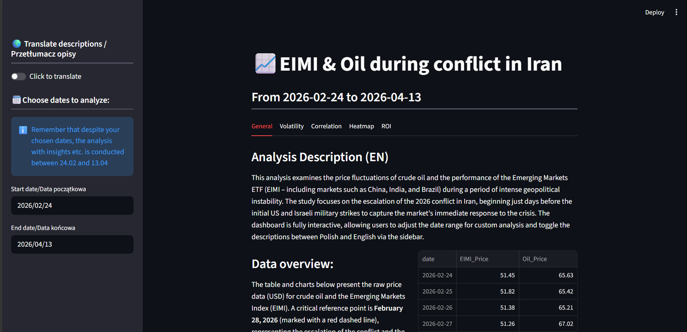

## 🔎 Details of the project
Below you will find a **detailed walkthrough of all the dashboard sections**. To ensure clarity, each section begins with a functional description and ends with a concise conclusion summarizing the key findings (with the exception of the ROI section, which serves as an interactive simulation tool).

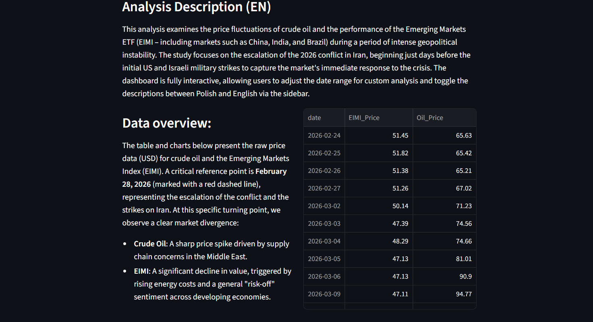
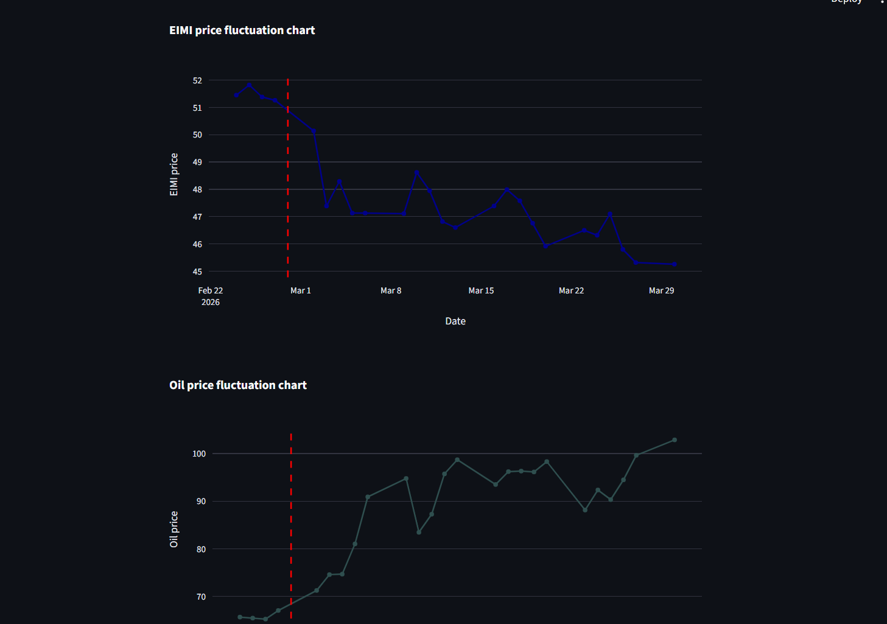
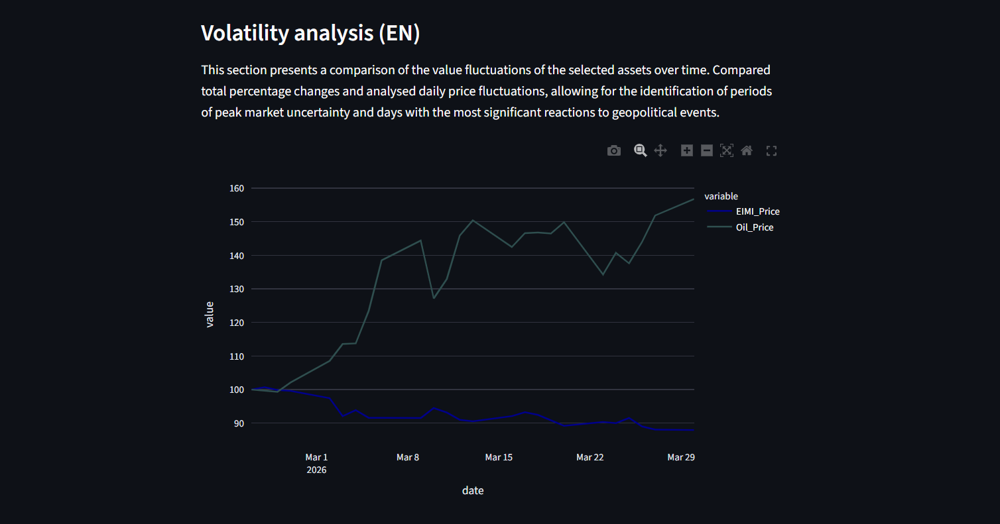
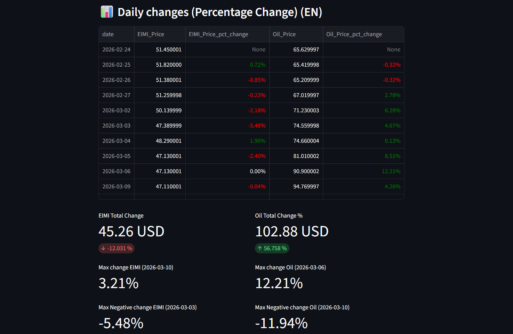
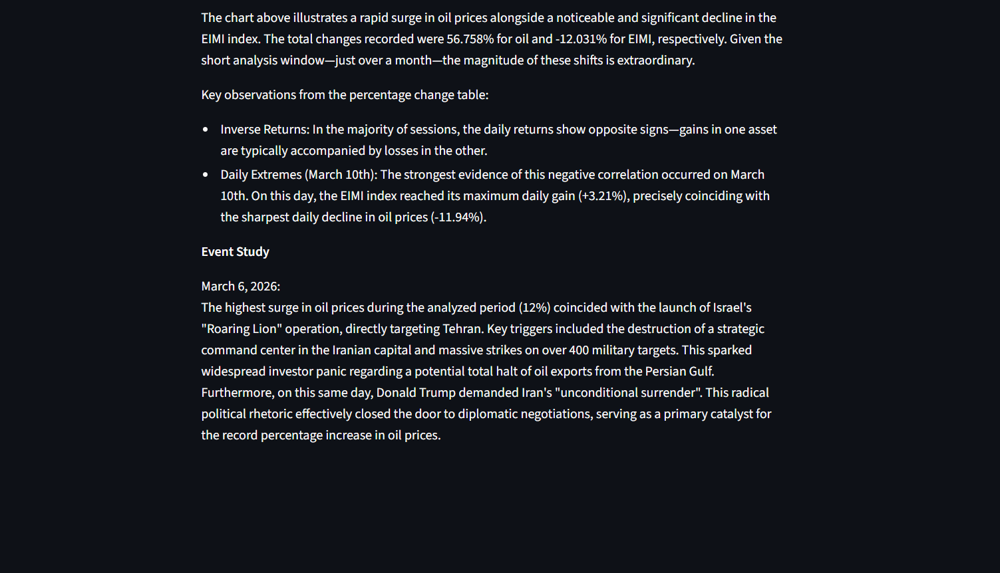
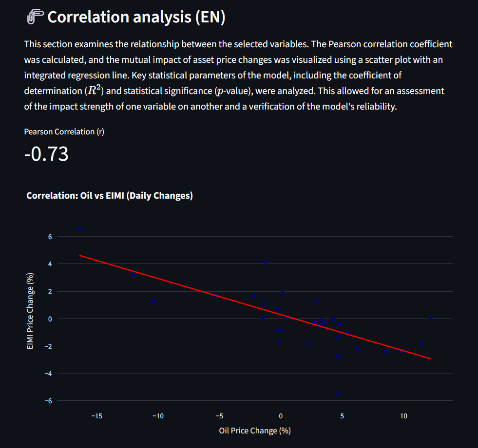
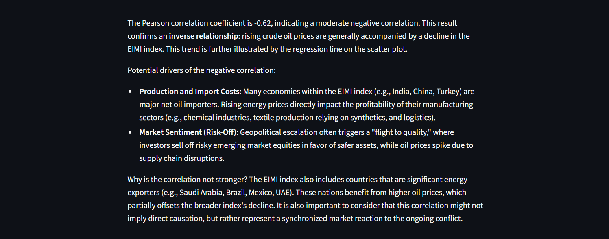
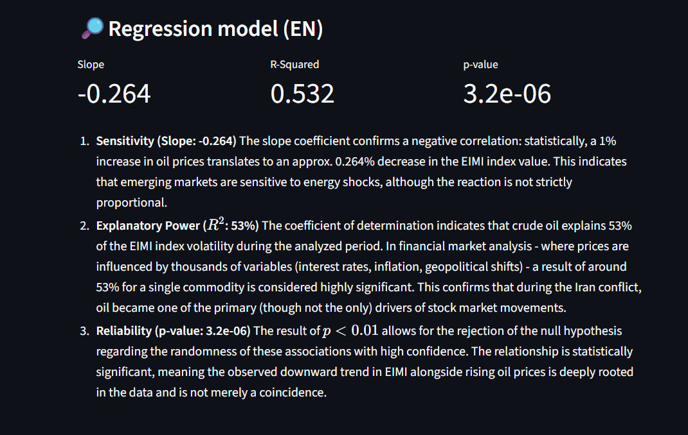
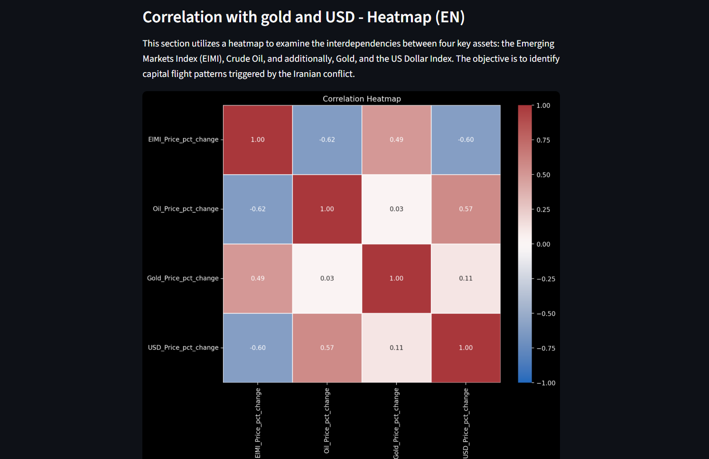
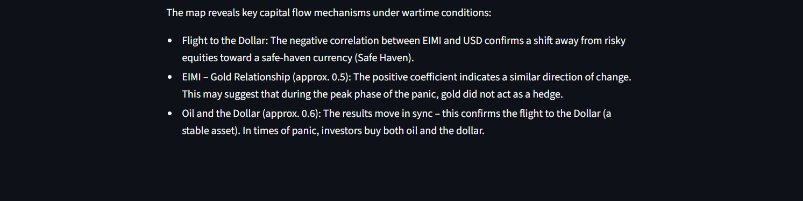
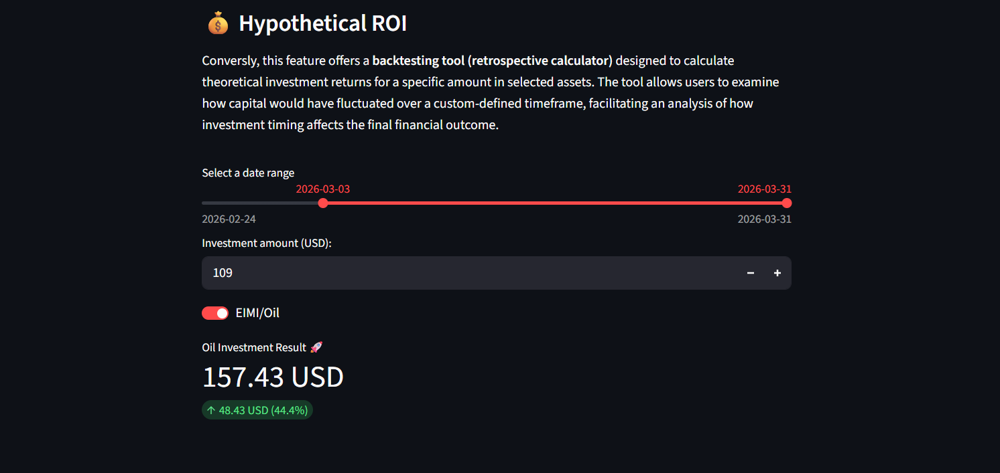

---
Experience the full potential of this interactive analysis by running the dashboard locally. Check out the Installation section above to get started! ⭐


